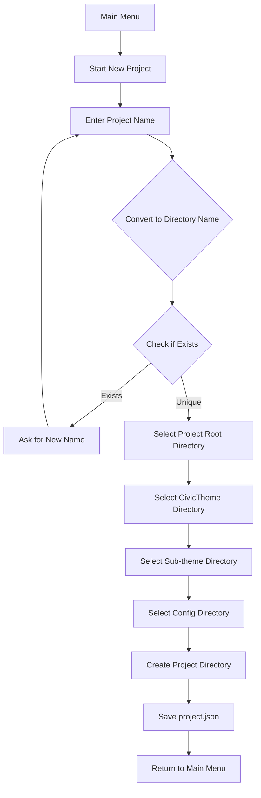
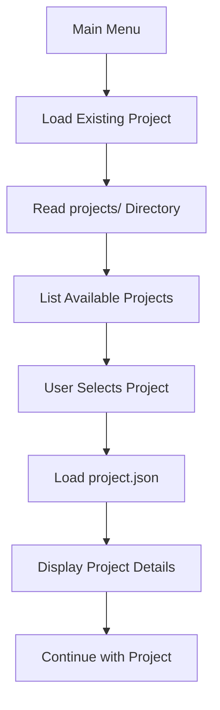
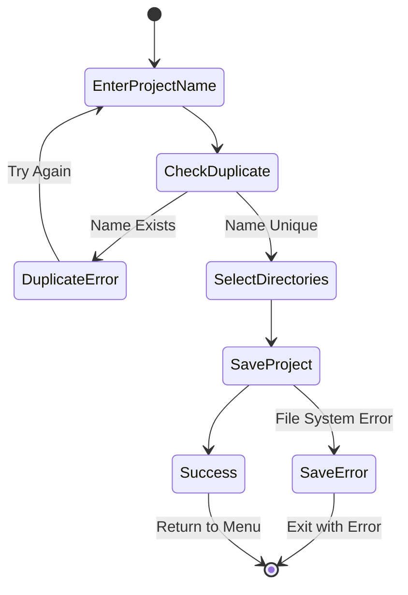

# Project Configuration Flow Diagram

## Start New Project Flow



## Load Existing Project Flow



## Project Structure

```
projects/
├── my-civic-project/
│   └── project.json
├── client-website-update/
│   └── project.json
└── test-project/
    └── project.json
```

## Configuration File Format

```json
{
  "name": "My Civic Project",
  "directoryName": "my-civic-project",
  "basePath": "/home/user/projects/my-site",
  "civicThemePath": "/home/user/projects/my-site/themes/contrib/civictheme",
  "subThemePath": "/home/user/projects/my-site/themes/custom/my_theme",
  "configPath": "/home/user/projects/my-site/config/sync",
  "createdAt": "2024-01-20T10:00:00Z",
  "updatedAt": "2024-01-20T10:00:00Z"
}
```

## Error Handling States

